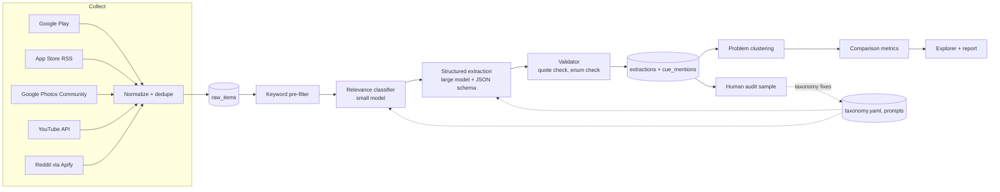

# Architecture

How the discovery engine turns raw public conversation into comparable, evidence-backed photo-retrieval problems. Companion to `retrieval plan.md` (what we collect) and `context.md` (the problem space and taxonomies), all in `docs/`.

**Phase 0 change:** the store is initialised by `src/engine/cli.py init-db` from `src/engine/schema.sql`, so there is no separate `store.py` yet. Source list changed: Apple Community is dropped and Google Photos Community is enabled (collected by a browser-assisted parser; see `retrieval plan.md` 4.3).

## 1. Design principles

1. **The schema and taxonomy are the product.** The tools around them (scrapers, LLMs, clustering library) are replaceable.
2. **Every insight resolves to a verbatim quote and a source URL.** No finding without evidence.
3. **Cheap before expensive.** Regex, then a small model, then a large model, so cost tracks signal, not volume.
4. **Separate raw data, extraction, and analysis.** Any layer can be re-run without redoing the others.
5. **Boring stack.** Plain Python and SQLite; add infrastructure only when a real limit is hit.

## 2. Pipeline overview



## 3. Components

### 3.1 Collectors (`src/collectors/`)
One small module per source, all returning the unified raw record defined in `retrieval plan.md` section 6. Config lives in `config/sources.yaml` (apps, queries, subreddits, date window, compliance notes). Collectors only fetch and normalize; they know nothing about relevance or analysis.

### 3.2 Raw store
SQLite database (`data/engine.db`), table `raw_items`, plus the untouched payload in `raw_json`. De-duplication on `item_id` and `content_hash` happens on insert. Raw data is append-only; nothing downstream edits it.

### 3.3 Keyword pre-filter
Regex over text using the term lists in `retrieval plan.md` section 5. Recall-oriented. Writes a boolean `prefilter_pass`.

### 3.4 Relevance classifier
A small, fast free-tier model (Gemini Flash-Lite, Groq as fallback; see `config/llm.yaml`) reads batches of about 20 items per request and, for each, answers one question: is this about *finding or re-finding existing photos*? It also assigns a coarse `problem_family` so non-search issues are separated out early:

`search_or_retrieval` | `backup_or_sync` | `account_or_access_loss` | `deletion_or_corruption` | `quality_or_editing` | `billing_or_storage` | `other`

Only `search_or_retrieval` (and ambiguous items flagged for review) continue. The other families are kept and counted, not thrown away, because "how much of 'can't find my photos' is really not search?" is itself a finding.

### 3.5 Structured extractor
The free-tier model `gemini-3.5-flash-lite` (the stronger Flash models allow only 20 requests a day; see `config/llm.yaml`) receives about 8 items per request, each with its context (thread title, parent post, app/product, rating), and returns one record per item that conforms to a JSON schema using the provider's structured-output mode. The schema is defined in section 5. Instructions and the taxonomy are held in files (`prompts/`, `taxonomy.yaml`) and versioned. **Zero-spend constraint:** the extractor is a thin wrapper (`llm.py`) with a rate limiter that stays inside the free-tier requests-per-minute and requests-per-day, stops for the day when the quota is used, and resumes the next day. It never enables billing. Batching several items per request is what makes the daily request quota sufficient.

### 3.6 Validator
Deterministic code, no model calls. Rejects or flags an extraction if:
- any `evidence_quote` is not a verbatim substring of the source text (after whitespace normalization),
- an enum value is not in `taxonomy.yaml`,
- a "remembered" or "forgotten" cue has no quote,
- required fields are missing.

Failures are retried once with the error message; persistent failures go to a `needs_review` table. This is the main defence against hallucinated evidence.

### 3.7 Extraction store
Two tables so comparison queries are simple:

- `extractions`: one row per relevant item, flattened key fields plus the full JSON.
- `cue_mentions` (long form): `item_id, cue_type, cue_value, status (remembered | forgotten | unknown), quote`. This is what makes "what do people remember vs. forget" a single `GROUP BY`.

### 3.8 Problem clustering
*As built in Phase 5:* the 10 retrieval failure modes are grouped into 6 groups, then each group is split with Ward agglomerative clustering on local MiniLM embeddings of the thread title plus the extractor's one-line description; Gemini names the clusters; a 10-item human check merges, renames or sets aside weak ones (`eval/cluster_audit.json`). HDBSCAN was not used because at 287 items it leaves too many points unassigned.
Two steps:
1. **Structured grouping.** Group first on extracted structure: `failure_mode` x `target_photo_type` x `cue_mismatch`. This keeps clusters about *problems*, not writing style or platform.
2. **Semantic sub-clustering.** Within each group, embed a short "problem signature" (a model-written one-sentence summary of what was being looked for, what was remembered, and what failed) with a local embedding model, then cluster with HDBSCAN or agglomerative clustering. A model names each cluster, writes a one-line definition, and picks 3 to 5 representative quotes. Names must cite member item ids.

### 3.9 Comparison metrics
Computed per cluster from SQL, not by a model:
- **Frequency:** items and share of relevant items (reported as "mentions in the sample", not a population rate)
- **Spread:** number of distinct sources and products (a problem seen in one place is weaker)
- **Severity:** distribution across `inconvenience | time_loss | emotional_loss | data_loss`
- **Cue profile:** top remembered cues, top forgotten cues
- **Query behavior:** share with a stated query, top workarounds
- **Outcome mix:** found / not found / abandoned / switched product
- **Underserved score:** share of items with no working workaround and outcome not found
- **Recency trend:** monthly mentions, to separate regressions from persistent problems
- **Evidence strength:** count of distinct sources with a supporting quote

### 3.10 Explorer and report
A single Streamlit app over the SQLite file with: cluster list (sortable by the metrics above), cluster detail with quotes and source links, a remember-vs-forget view, a product/source comparison, and item-level drill-down. A generated `report.md` answers the four discovery questions with linked evidence. No separate backend.

### 3.10a Insight layer (built after the first Explorer)
`src/engine/insights.py` sits between the metrics and the Explorer. Code detects contrasts (a cluster that differs from the rest on source, outcome, cues or change-of-behaviour wording), attaches the numbers and verbatim quotes, and sets a confidence level from sample size and effect size. A model only writes the wording, and its text is rejected if it contains a number that is not in the facts, overclaims for the size of the effect, or fails a second-pass check against the facts; weak signals are shown as plain notes. Output goes to `eval/results/insights.json`, the Explorer's landing view and the "Key insights" block of `report.md`. The "Interpretation" line is a hypothesis to test, not a finding.

### 3.10b Refresh and regression
`engine refresh` collects only items newer than each source's newest stored item (minus a 3-day overlap), then runs the filter, relevance and extraction stages on items not yet processed and puts new failures in the nearest existing cluster (approximate; rebuild clusters when themes may have changed). Each stage skips work already done, so a run can be repeated or resumed after a free-quota stop. `engine regress` re-runs the classifier and extractor on the labeled sets and compares with `eval/baseline.json`; run it after any prompt, taxonomy or model change. Each run records the taxonomy version and prompt hashes in the `runs` table.

### 3.11 Human audit loop
Every phase includes a hand-labeled sample (target sizes in `implementation plan.md`). Disagreements update the taxonomy or prompts, and each change bumps `taxonomy_version`, so any extraction can be traced to the taxonomy and prompt it was produced with.

## 4. Technology choices

| Concern | Choice | Why | Revisit when |
|---|---|---|---|
| Language / orchestration | Python scripts + a small CLI (`python -m engine collect|filter|extract|cluster`) | Simplest; runs locally or on a scheduler | Runs need scheduling or parallelism beyond one machine |
| Workflow tool (n8n, Zapier) | Not used in v1 | The pipeline is linear code with retries; a visual tool adds a second place to maintain logic | You want non-engineers to trigger or monitor runs |
| Store | SQLite | Zero setup; enough for tens of thousands of rows | Concurrent writers or multi-user access |
| Reddit | Apify actor (search URLs and keyword-filtered top-of-year listings) | Decided; see `retrieval plan.md` | Reddit terms or actor reliability change |
| Extra sources | Stack Exchange API, Hacker News API | Free, official, no scraping; added as a narrative-source test | Neither improved memory-cue coverage |
| Relevance model | Gemini Flash-Lite, free tier (Groq free tier as fallback) | Free, no card, high daily request quota, structured output | Recall on the labeled set falls short, or Google changes the free tier |
| Extraction model | `gemini-3.5-flash-lite`, free tier | The Flash models measured at 20 requests per day, the newest returned 503s; flash-lite has real quota and passed the quote validator 188 of 190 times | Extraction quality falls short of the gold-set targets, or a stronger model gets real quota |
| Cost control | Batch several items per request; rate limiter; daily-quota stop | Total spend is $0 by design; billing is never enabled | n/a |
| Local LLM (Ollama) | Not used | This machine is CPU-only with 15.7 GB RAM and about 10 GB free disk, far too slow for thousands of extractions | You get a GPU or a much bigger machine |
| Embeddings | Local `sentence-transformers` model | Free, no extra API key, adequate for short signatures | Cluster quality is poor |
| Clustering | HDBSCAN (fallback: agglomerative) | No need to pick the number of clusters | n/a |
| UI | Streamlit | One file, Python-native | You need a public, shareable site |
| Secrets | `.env` file, not committed | Gemini, Apify, YouTube (and optional Groq) keys, all free tiers | Team use |

**Where RAG fits.** A retrieval layer (vector search over `extractions` and raw text) is not needed to *produce* findings. It is useful later for a "ask the corpus" feature in the Explorer, and can be added on top of the same SQLite data plus the embeddings without changing the pipeline.

## 5. Extraction schema (v0, from `context.md` sections 4 to 9)

One record per relevant item. Enum lists are seeded from `context.md` and will change after the pilot.

```json
{
  "item_id": "reddit:abc123",
  "is_retrieval_related": true,
  "problem_family": "search_or_retrieval",
  "target": {
    "photo_type": "early_digital | scanned_print | migrated | received_forwarded | screenshot_functional | person_face_related | corrupted | unknown",
    "photo_age": "text as stated, or null",
    "description": "what the user was trying to find"
  },
  "cues": [
    {
      "type": "who | when | where | event | appearance | provenance | purpose | emotion | text_in_photo | negation",
      "value": "short normalized value",
      "status": "remembered | forgotten | unknown",
      "quote": "verbatim supporting span"
    }
  ],
  "search_behavior": {
    "queries_tried": ["verbatim queries, if stated"],
    "pattern": "broad_then_browse | time_anchor | descriptive | category_guess | vocabulary_mismatch | conversational | other | not_stated",
    "workaround": "text or null"
  },
  "failure_mode": "not_indexed | vocabulary_mismatch | ranking_failure | missing_wrong_metadata | identity_failure | content_type_gap | cue_mismatch | scale_or_speed | regression | not_a_search_problem",
  "severity": "inconvenience | time_loss | emotional_loss | data_loss | unclear",
  "outcome": "found | not_found | abandoned | switched_product | unclear",
  "product_mentioned": "Google Photos | Apple Photos | ...",
  "confidence": "high | medium | low",
  "evidence_quotes": ["verbatim spans supporting failure_mode and outcome"],
  "taxonomy_version": "v0"
}
```

Design notes:
- `status: unknown` is legitimate; the extractor is instructed not to guess. Sparse records are normal because most reviews are short.
- `failure_mode` can be `not_a_search_problem` even for items that passed the relevance step; that value is a result, not an error.
- One item can have several cues; it can have only one `failure_mode` (the primary one), with secondary modes allowed in a follow-up version if the pilot shows frequent overlap.

## 6. Data model summary

```
raw_items(item_id PK, source, product, url, thread_id, parent_id, author_hash,
          created_at, fetched_at, title, text, rating, helpful_count,
          app_or_os_version, locale, content_hash, raw_json)
filter_results(item_id, prefilter_pass, relevant, problem_family, model, run_id)
extractions(item_id PK, json, failure_mode, severity, outcome, photo_type,
            product_mentioned, confidence, taxonomy_version, model, run_id)
cue_mentions(item_id, cue_type, cue_value, status, quote)
clusters(cluster_id, name, definition, taxonomy_version, run_id)
cluster_items(cluster_id, item_id)
runs(run_id, stage, source, params_json, started_at, counts_json, cost_estimate, errors_json)
needs_review(item_id, reason, payload_json)
```

## 7. Repository layout

```
discovery engine/
  docs/          problem statement.txt, context.md, retrieval plan.md,
                 architecture.md, implementation plan.md
  config/        sources.yaml, taxonomy.yaml                         (built in Phase 0)
  src/engine/    schema.sql, cli.py                                  (built in Phase 0)
                 collectors/, filter.py, extract.py, validate.py,
                 cluster.py, metrics.py                              (later phases)
  tests/         test_phase0.py
  prompts/       relevance.md, extraction.md, cluster_naming.md      (Phases 2-5)
  app/           explorer.py                                         (Phase 6)
  data/          engine.db, exports/                                 (git-ignored)
  eval/          labeled_relevance.csv, labeled_extraction.jsonl, results/
  .env, .env.example, .gitignore, requirements.txt
```

## 8. Quality and evaluation

Targets are *planning assumptions* to be reset after the first labeled sample.

- **Relevance filter:** recall of at least 90% on a 300-item hand-labeled sample (missing relevant items is worse than reading a few extra), precision of at least 70%.
- **Extraction:** at least 85% agreement on `failure_mode`, `outcome`, and `photo_type` against 100 hand-labeled items; cue-level check on a smaller sample.
- **Evidence integrity:** 100% of stored quotes are verbatim substrings of the source; enforced by the validator, not by sampling.
- **Clusters:** a human reads 10 random items per cluster; a cluster passes if at least 8 of 10 fit its definition.
- **Stability:** re-running extraction on a 100-item sample gives the same `failure_mode` for at least 90% of items.

## 9. Risks specific to this architecture

| Risk | Mitigation |
|---|---|
| Extractor invents cues or quotes | Verbatim-quote validator; `unknown` is allowed; audit sample |
| Taxonomy drifts mid-project | `taxonomy_version` on every row; re-extract only affected rows |
| Clusters reflect platform or writing style | Cluster on extracted structure first, embeddings second |
| Google Photos dominates the corpus | Per-product quotas at collection (see retrieval plan); per-product views in the Explorer |
| Free-tier quota too small or changed | Batch items per request; regex pre-filter first; Groq fallback; log requests used per day in `runs`; shrink volume rather than pay |
| Free-tier privacy terms | Gemini's free tier may use prompts to improve Google models; only public posts are ever sent |
| Apify free credit ($5/month hard stop) | Cap Reddit volume; the free plan blocks rather than bills; spread collection across billing months |
| Apify or a source changes shape | Collectors isolated per source; raw payload kept; `runs` log flags zero-row collections |
| Findings mistaken for prevalence | Metrics named "mentions in sample"; report states selection bias prominently |
| Reddit / site terms | Compliance notes per source in `sources.yaml`; disclose methods |

## 10. Deliberately not in v1

Real-time ingestion, multilingual support, a hosted multi-user service, fine-tuned models, an n8n or Zapier layer, a separate vector database, and automatic taxonomy discovery without human review.
